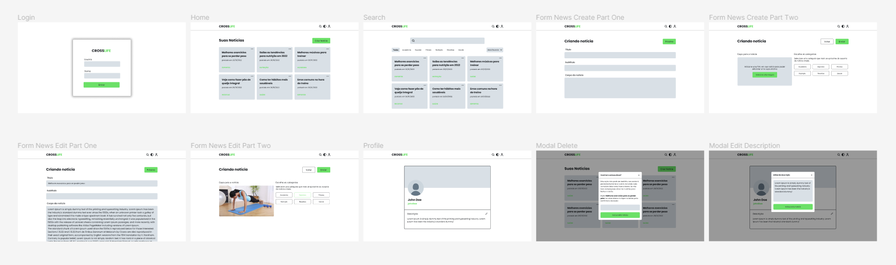

# Gerenciador do Blog Crosslife Suzano
O gerenciador do blog da Crosslife é um projeto que será desenvolvido para web, com o intuito de servir como uma plataforma para fazer o gerenciamento completo das notícias e perfil do autor, tambem vai ser utilizado para o trabalho de conclusão de curso da faculdade IMPACTA. O layout foi feito inteiramente no Figma. Para ver o design completo clique [aqui](https://www.figma.com/file/rUg0I5bbcGBLD5m5dYCH9H/Gerenciador-do-blog-crosslife?node-id=0%3A1)



## Funcionalidades
Todas as funcionalidades foram desenvolvidas para tornar a vida do usuário o mais simples possível, elas são:
* Criar e gerenciar notícia (CRUD).
* Pesquisar e filtar notícia.
* Mudar dados de perfil do autor.
* Mudar tema entre escuro e claro.

## Tecnologias
Foram utilizados as seguintes tecnologias para o desenvolvimento:
* React
* React router dom
* Date fns

## Como executar o projeto
Antes de começar a preparar todo o ambiente para a execução, é necessário antes ter a API do gerenciador do blog rodando em sua máquina. Para saber o passo a passo de como executar a API é so clicar [aqui](https://github.com/caio1902araujo/crosslife-api).

#### 1. Executando a aplicação com npm
```javascript
// Clonando repositório:
git clone https://github.com/caio1902araujo/crosslife-blog-manager.git

// Entrando no diretório:
cd crosslife-blog-manager

// Instalando dependências:
npm install package.json

// Rodar a aplicação:
npm run start
```

#### 2. Executando aplicação com yarn
```javascript
// Clonando repositório:
git clone https://github.com/caio1902araujo/crosslife-blog-manager.git

// Entrando no diretório:
cd crosslife-blog-manager

// Instalando dependências:
yarn

// Rodar as migrations:
yarn typeorm migration:run

// Rodar a aplicação:
yarn start
```
